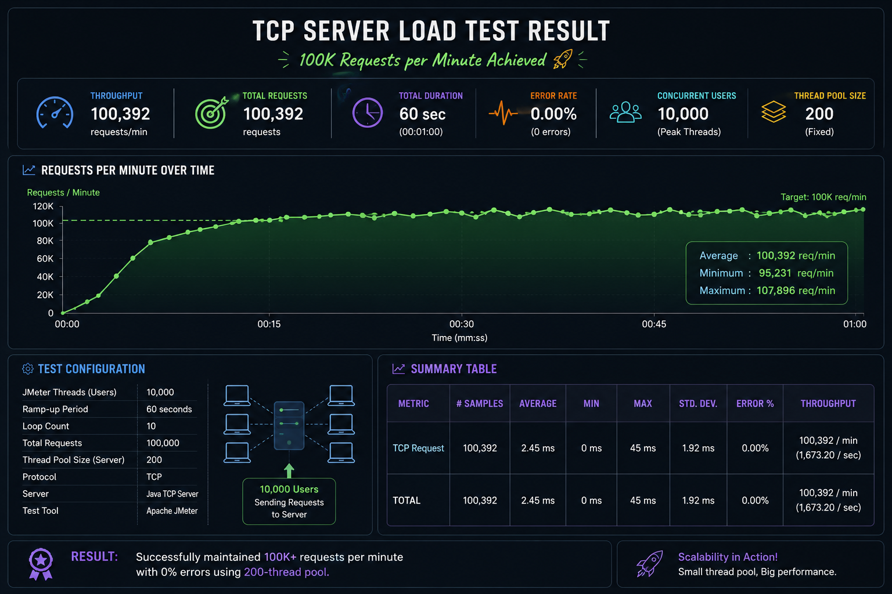
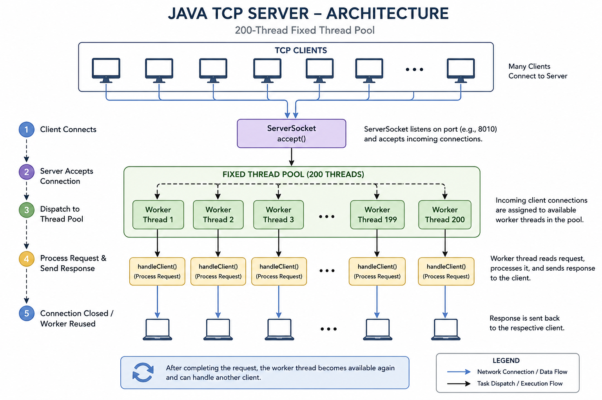
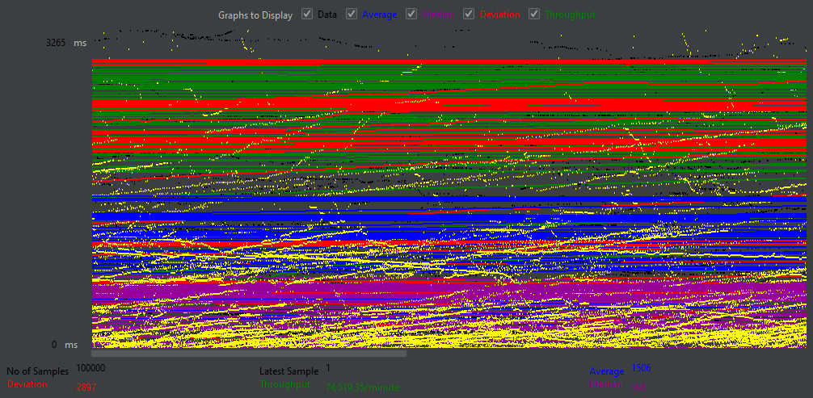
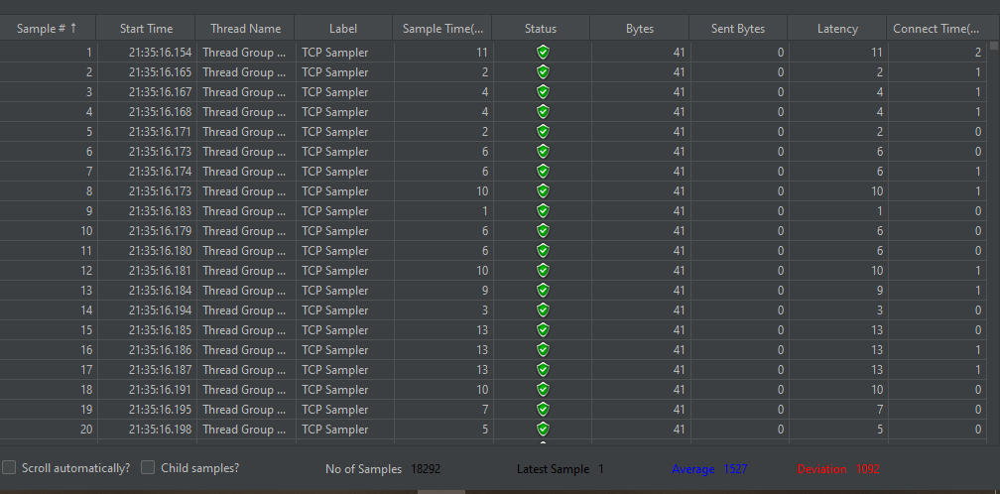

# 🚀 High-Concurrency Java TCP Server
-----


----
A multithreaded TCP server built from scratch using **Java Socket Programming and a fixed-size Thread Pool**.

The project focuses on understanding how Java handles concurrent TCP clients using reusable worker threads and how a server behaves under increasing workloads.

The server has been load tested using **Apache JMeter**, successfully processing **100,000 requests with a 200-thread pool** under the tested environment.

---

## 🏗️ Architecture



The server follows a simple **ServerSocket + Thread Pool** architecture:

```text
                       TCP Clients
                    /   /   |   \   \
                   ↓   ↓    ↓    ↓   ↓
            ┌──────────────────────────┐
            │       ServerSocket       │
            │         accept()         │
            └────────────┬─────────────┘
                         │
                         ↓
                  Fixed Thread Pool
                         │
              ┌──────────┼──────────┐
              ↓          ↓          ↓
           Worker 1   Worker 2   Worker 3
              │          │          │
              └──────────┼──────────┘
                         ↓
                   handleClient()
                         │
                         ↓
                  Send Response
                         │
                         ↓
                      Client
```

---

## 🧵 Thread Pool

The server uses a **fixed thread pool of 200 worker threads**.

```java
int poolSize = 200;

Server server = new Server(poolSize);
```

The pool is created using:

```java
this.threadPool =
        Executors.newFixedThreadPool(poolSize);
```

When a client connects, the server submits the client-handling task to the pool:

```java
Socket clientSocket = serverSocket.accept();

server.threadPool.execute(
    () -> server.handleClient(clientSocket)
);
```

### Why use a Thread Pool?

Without a thread pool, a new thread could be created for every client:

```text
Client 1 → Thread 1
Client 2 → Thread 2
Client 3 → Thread 3
...
Client N → Thread N
```

With a thread pool:

```text
                  Thread Pool
        ┌─────────────────────────┐
        │ T1 T2 T3 ... T200       │
        └────────────┬────────────┘
                     │
              Client Tasks
                     │
          ┌──────────┼──────────┐
          ↓          ↓          ↓
       Request    Request    Request
```

The worker threads are **reused** for multiple client requests instead of continuously creating new threads.

This provides controlled concurrency and avoids the overhead of creating an extremely large number of threads.

---

# 🔄 Request Flow

```text
1. Client connects
        ↓
2. ServerSocket.accept()
        ↓
3. Socket is created
        ↓
4. Task submitted to Thread Pool
        ↓
5. Available worker handles client
        ↓
6. Server sends response
        ↓
7. Socket is closed
        ↓
8. Worker becomes available
        ↓
9. Worker can handle another client
```

---

# 💻 Core Implementation

The server accepts connections continuously:

```java
while (true) {

    Socket clientSocket =
            serverSocket.accept();

    server.threadPool.execute(
        () -> server.handleClient(clientSocket)
    );
}
```

The client is handled by a worker thread:

```java
public void handleClient(Socket clientSocket) {

    try (
        PrintWriter toSocket =
            new PrintWriter(
                clientSocket.getOutputStream(),
                true
            )
    ) {

        toSocket.println(
            "Hello from server "
            + clientSocket.getInetAddress()
        );

    } catch (IOException ex) {
        ex.printStackTrace();
    }
}
```

---

# 🧪 Load Testing

The server was tested using **Apache JMeter**.

### Test Configuration

| Parameter      |          Value |
| -------------- | -------------: |
| Thread Pool    |        **200** |
| JMeter Threads |     **10,000** |
| Ramp-up Period | **60 seconds** |
| Loop Count     |         **10** |
| Total Requests |    **100,000** |
| Result         | **Successful** |

### How were 100,000 requests generated?

JMeter was configured with:

```text
10,000 Threads
×
10 Loops
=
100,000 Requests
```

The **loop count** specifies how many times each JMeter thread executes the request.

For example:

```text
10,000 users
×
10 requests per user
=
100,000 total requests
```

---

# 📊 Benchmark Result

The current benchmark successfully processed:

> **100,000 TCP requests using a 200-thread fixed thread pool.**

This result was obtained under the current testing environment and configuration.

It demonstrates that a relatively small number of reusable worker threads can process a much larger number of requests over the lifetime of the test.

---

# 📈 Graph Result

The following screenshot shows the **JMeter graphical representation of the test results**.



The graph can be used to observe response-time behavior and how the server performs during the load test.

---

# 📋 Table Result

The following screenshot shows the **JMeter tabular result** containing the measured request statistics.



Important metrics include:

* Number of samples
* Average response time
* Minimum response time
* Maximum response time
* Error percentage
* Throughput
* Standard deviation

---

# 📊 Benchmark Summary

| Test              | JMeter Threads | Loop Count | Total Requests | Thread Pool | Status       |
| ----------------- | -------------: | ---------: | -------------: | ----------: | ------------ |
| Current Benchmark |         10,000 |         10 |    **100,000** |     **200** | ✅ Successful |

---

# 🎯 1 Million Request Goal

The next scalability target is **1,000,000 total requests**.

The same concept can be used:

```text
10,000 Threads
×
100 Loops
=
1,000,000 Requests
```

However, **1M total requests does not automatically mean 1M requests per minute**.

To process 1,000,000 requests within 60 seconds, the required average throughput would be approximately:

```text
1,000,000 / 60
≈ 16,667 requests/second
```

Therefore, the 1M test will be evaluated using:

* Total requests
* Test duration
* Throughput
* Error percentage
* Average latency
* p95 latency
* p99 latency
* CPU utilization
* Memory utilization

The project will use actual benchmark measurements rather than assuming that a higher request count automatically means better performance.

---

# 📈 Scalability Testing Plan

The load will be increased progressively:

```text
100K
 ↓
250K
 ↓
500K
 ↓
1M
```

At each stage, the following metrics will be compared:

```text
Requests
Throughput
Error %
Average
p95
p99
CPU
RAM
```

This helps identify the point where the server reaches its practical capacity.

---

# ⚠️ Important Scalability Consideration

A **200-thread pool does not mean only 200 requests can be processed in total**.

It means approximately 200 worker tasks can execute concurrently.

After a worker finishes:

```text
Worker
  ↓
Request completed
  ↓
Worker becomes free
  ↓
Next request
```

Therefore:

```text
200 Threads
        ↓
Request 1 → Worker 1
Request 2 → Worker 2
...
Request 200 → Worker 200
        ↓
Workers finish
        ↓
Next requests reuse workers
```

This is why the server can process **100,000 total requests using only 200 worker threads**.

---

# 🖥️ Performance Depends on the Environment

The measured performance depends on:

* CPU
* RAM
* JVM
* Operating system
* TCP stack
* Network
* JMeter configuration
* Number of concurrent connections
* Thread-pool size

For large-scale testing, the load generator should ideally run on a separate machine from the server.

```text
┌──────────────────────┐
│    JMeter Machine    │
│    Load Generator    │
└──────────┬───────────┘
           │
           │ TCP
           ↓
┌──────────────────────┐
│     Java Server      │
│                      │
│    ServerSocket      │
│         ↓            │
│   200 Worker Threads │
└──────────────────────┘
```

---

# 🛡️ Future Improvements

* Custom `ThreadPoolExecutor`
* Bounded task queue
* Backpressure
* Connection limits
* Request timeout
* Idle connection timeout
* Rate limiting
* Graceful shutdown
* Performance monitoring
* Prometheus metrics
* Grafana dashboard
* JVM profiling
* GC analysis
* Linux network tuning
* Distributed JMeter testing
* Horizontal server scaling
* Docker deployment

---

# 🧠 Concepts Demonstrated

This project demonstrates practical understanding of:

* TCP/IP
* Java Socket Programming
* `ServerSocket`
* `Socket`
* Java Threads
* `ExecutorService`
* Fixed Thread Pool
* Concurrent request handling
* Resource management
* Load testing
* Throughput
* Latency
* Performance benchmarking
* Scalability

---

# 🚀 Running the Server

### Compile

```bash
javac src/Server.java
```

### Run

```bash
java -cp src Server
```

The server listens on:

```text
localhost:8010
```

---

# 📌 Current Status

```text
✅ TCP Server
✅ Multithreading
✅ 200-thread pool
✅ JMeter load testing
✅ 100,000 successful requests
🔄 250,000 request test
🔄 500,000 request test
🎯 1,000,000 request target
```

---

# 🎓 Project Objective

The objective of this project is to understand how a **multithreaded Java TCP server behaves under increasing workloads** and how thread-pool configuration affects concurrency, throughput, and latency.

Rather than simply creating a server that works, the project focuses on:

```text
Build
  ↓
Load Test
  ↓
Measure
  ↓
Identify Bottleneck
  ↓
Optimize
  ↓
Load Test Again
```

The long-term goal is to understand the engineering trade-offs involved in building scalable concurrent server applications.
